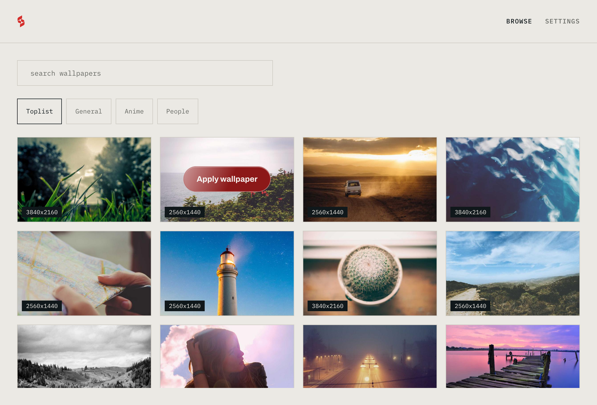

<div align="center">


# Spiral Wallpaper

**Click a wallpaper. It downloads and applies. That's it.**

[](https://github.com/cococool13/spiral-wallpaper/actions/workflows/build.yml)


[](LICENSE)



<sub>The Browse screen. Thumbnails above are dev-preview placeholders; the app browses Wallhaven.</sub>

</div>

A free desktop wallpaper app for macOS and Windows, built on three things it
actually does rather than promises:

- **Privacy.** No account. No telemetry. Zero network requests until you
  search or apply; every request goes to Wallhaven and nowhere else. All
  networking runs in the Rust core, never the webview.
- **Ease.** One Browse screen, one Settings page, one first-run sentence.
  The app quits when you close the window. Nothing runs in the background.
- **Super lightweight.** 4.6 MB binary, ~95 MB idle RAM, window on screen in
  0.23 s (measured on Apple Silicon). Tauri 2, not Electron.

Everything the app does is stated on-screen before it happens. Downloaded
files are verified to actually be images before they touch disk. The
thumbnail cache is capped at 200 MB and says so in Settings.

## Download

Get the current version from the
[latest release](https://github.com/cococool13/spiral-wallpaper/releases/latest):

- **macOS 13+** - `Spiral.Wallpaper_1.0.1_universal.dmg`. Signed with a Developer ID
  and notarized by Apple; universal binary, runs native on Apple Silicon and
  Intel. Open the DMG, drag Spiral into Applications. That's the whole
  install.
- **Windows 10+** - `Spiral.Wallpaper_1.0.1_x64-setup.exe` (or the `.msi`). Not yet
  code-signed, so SmartScreen warns on first run: More info, then Run anyway.

SHA-256 checksums for every file are attached to the release as
`SHA256SUMS.txt`.

## Build from source

Needs Node 18+, pnpm, and Rust (rustup). On macOS: `xcode-select --install`.
On Windows: Microsoft C++ Build Tools.

```bash
cd spiral-wallpaper
pnpm install
pnpm tauri dev      # run the app
pnpm tauri build    # release bundles (.app/.dmg or .exe/.msi)
```

`pnpm build` runs the quality gates: a guard that fails the build on any hex
color outside the design tokens, then typecheck, then Vite.
`SPIRAL_SMOKE=1 pnpm tauri dev` runs a full end-to-end smoke test (search,
cache, download, set wallpaper, verify) and restores your wallpaper after.

## What's in this repo

| Path | What |
| --- | --- |
| [`spiral-wallpaper/`](spiral-wallpaper/) | The app: React + TypeScript UI, Rust core, branded DMG + NSIS installers |
| [`CLAUDE.md`](CLAUDE.md) / [`AGENTS.md`](AGENTS.md) | The build briefs the app was built from: brand tokens, stack, scope |
| [`assets/`](assets/) | The Spiral brand kit: mark, lockup, icon pipeline, full brand guide (`spiral-brand-guide.html`) |
| [`PRODUCT.md`](PRODUCT.md) / [`DESIGN.md`](DESIGN.md) | Product context and the visual system, as shipped |
| [`reference/`](reference/) | External design reference material |

The design system is eight colors, two fonts, two radii, and one easing
curve, enforced by the build. When in doubt, open the brand guide.

## Roadmap, stated plainly

Next: a signed v1.0.0 release (macOS notarization + Windows signing), after
a runtime pass on real Windows hardware. On hold: additional wallpaper
sources (Unsplash and Pexels shipped briefly and were removed; the
`WallpaperSource` interface is waiting for them). Out of scope for v1:
animated wallpapers, auto-update, anything that phones home.

---

[MIT licensed](LICENSE). Wallpapers from [Wallhaven](https://wallhaven.cc).
Spiral is not affiliated.
